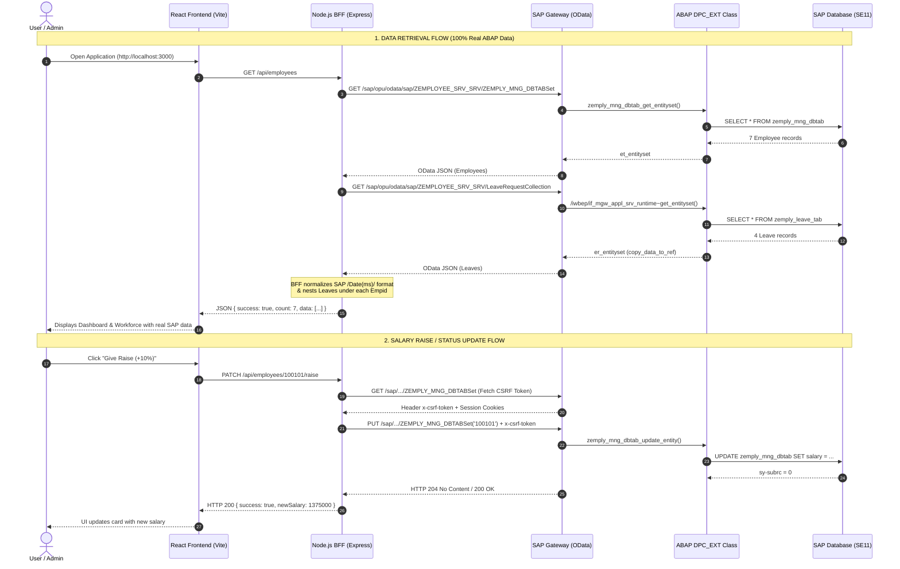

# 🏗️ System Architecture Documentation — WorkforceHub

An end-to-end technical reference explaining the multi-tier enterprise architecture of **WorkforceHub (SAP Employee & Leave Management System)**.

---

## 📑 Table of Contents
1. [High-Level Architecture Overview](#1-high-level-architecture-overview)
2. [Architectural Diagram](#2-architectural-diagram)
3. [Frontend Layer (React + Vite)](#3-frontend-layer-react--vite)
   - [What It Contains](#what-it-contains)
   - [Component Directory Breakdown](#component-directory-breakdown)
   - [Functions Used to Connect to the Backend](#functions-used-to-connect-to-the-backend)
4. [Middleware Layer (Node.js Express BFF / API Gateway)](#4-middleware-layer-nodejs-express-bff--api-gateway)
   - [Why a BFF is Required](#why-a-bff-is-required)
   - [What It Contains](#what-it-contains-1)
   - [Internal Functions Connecting to SAP OData](#internal-functions-connecting-to-sap-odata)
   - [REST API Endpoints Exposed to Frontend](#rest-api-endpoints-exposed-to-frontend)
5. [Backend Layer (SAP NetWeaver Gateway & ABAP)](#5-backend-layer-sap-netweaver-gateway--abap)
   - [Database Tables (SE11)](#database-tables-se11)
   - [SAP Gateway Service Builder (SEGW)](#sap-gateway-service-builder-segw)
   - [ABAP Classes (SE24) & Method Logic](#abap-classes-se24--method-logic)
   - [ABAP Data Population Programs (SE38)](#abap-data-population-programs-se38)
6. [Data Flow Lifecycle (Read & Write Walkthroughs)](#6-data-flow-lifecycle)
7. [Security & Authentication Architecture](#7-security--authentication-architecture)

---

## 1. High-Level Architecture Overview

WorkforceHub implements the **Backend-For-Frontend (BFF)** pattern to securely bridge a modern web UI with an on-premise/cloud **SAP NetWeaver Application Server (ABAP)**:

```
┌─────────────────────────────────┐
│     Client Browser (React)      │  <-- Single Page Application (Port 3000)
└────────────────┬────────────────┘
                 │ HTTP / REST / JSON
                 ▼
┌─────────────────────────────────┐
│  Node.js Express (BFF Gateway)  │  <-- Middleware (Port 5000)
│   • CORS Handling               │      Handles token handshakes & format normalization
│   • SAP Auth & Credential Hide  │
└────────────────┬────────────────┘
                 │ OData v2 over HTTPS (Basic Auth + CSRF)
                 ▼
┌─────────────────────────────────┐
│  SAP NetWeaver Gateway (SEGW)   │  <-- OData Service: ZEMPLOYEE_SRV_SRV
│   • ZCL_ZEMPLOYEE_SRV_DPC_EXT   │      ABAP Data Provider Class
└────────────────┬────────────────┘
                 │ OpenSQL
                 ▼
┌─────────────────────────────────┐
│     SAP Database Tables (SE11)  │  <-- ZEMPLY_MNG_DBTAB (Employees)
│                                 │  <-- ZEMPLY_LEAVE_TAB (Leaves)
└─────────────────────────────────┘
```

---

## 2. Architectural Diagram



---

## 3. Frontend Layer (React + Vite)

### What It Contains
Located in `/frontend`:
- **`src/App.jsx`**: Main application state controller, views router, modal manager, and API data fetcher.
- **`src/components/`**: Reusable modular UI components styled with enterprise SAP Fiori aesthetic.
- **`src/data/mockData.js`**: Contains **only** static department categories (`DEPARTMENTS`), with **zero mock employee data**.
- **`src/utils/jwtAuth.js`**: Client-side JWT generation, storage in `sessionStorage`, and role verification.
- **`src/index.css`**: Pure CSS custom design system (CSS variables, glassmorphism, responsive grid, status badges).
- **`vite.config.js`**: Development proxy configuration connecting `/api` to Node.js and `/sap` to NetWeaver Gateway.

### Component Directory Breakdown
| Component | File | Responsibilities |
| :--- | :--- | :--- |
| **Dashboard** | `DashboardView.jsx` | KPI metric tiles (Headcount, Active, On Leave, Dept Counts), salary charts, quick action shortcuts. |
| **Employees** | `EmployeesView.jsx` | Tabular & card grid directory, live search by name/email/ID, department filter, salary raise triggers. |
| **Leave Requests** | `LeaveRequestsView.jsx` | Leave management panel showing approval status badges, request reason, date spans, Approve/Reject buttons. |
| **Self Service** | `SelfServiceView.jsx` | Employee portal: view personal leave balance, upcoming leaves, and submit new leave requests. |
| **Analytics** | `AnalyticsView.jsx` | Department salary breakdowns, leave distribution analytics, and employee status ratios. |
| **Architecture** | `ArchitectureView.jsx` | In-app visual documentation explaining CDS views, ABAP handlers, and OData endpoints. |
| **Login** | `LoginScreen.jsx` | SAP-branded split-screen authentication supporting HR Admin (`ariz17`) and Employee (`parag12`). |
| **Modals** | `AddEmployeeModal.jsx`<br/>`GiveRaiseModal.jsx`<br/>`LeaveManagementModal.jsx` | Interactive popups for creating workforce records, applying salary raise percentages, and submitting leave forms. |

### Functions Used to Connect to the Backend
All communication logic in `App.jsx` is 100% reactive to real SAP data:

1. **`loadEmployees()` (inside `useEffect` in `App.jsx`)**:
   - Calls `fetch('/api/employees')` to request the live workforce from the Node.js API Gateway.
   - If running locally without Node.js, uses the Vite proxy fallback:
     ```javascript
     const [empRes, leaveRes] = await Promise.all([
       fetch('/sap/opu/odata/sap/ZEMPLOYEE_SRV_SRV/ZEMPLY_MNG_DBTABSet?$format=json', { headers }),
       fetch('/sap/opu/odata/sap/ZEMPLOYEE_SRV_SRV/LeaveRequestCollection?$format=json', { headers })
     ]);
     ```
   - Normalizes the SAP OData payload and passes it directly to `setEmployees(sapEmployees)`.

2. **`syncLeaveStatusToBackend(empid, leaveId, status)`**:
   - Sends a `PATCH` request to `/api/employees/${empid}/leave/${leaveId}` with `{ status }` (`APPROVED` or `REJECTED`).

3. **`syncNewLeaveToBackend(empid, newLeave)`**:
   - Sends a `POST` request to `/api/employees/${empid}/leave` with the leave payload (Start Date, End Date, Reason, Days Count).

4. **`handleResetData()`**:
   - Clears any local cache and triggers a fresh read from `/api/employees` to reload data directly from the SAP ABAP backend.

---

## 4. Middleware Layer (Node.js Express BFF / API Gateway)

### Why a BFF is Required
1. **CORS (Cross-Origin Resource Sharing)**: SAP NetWeaver Gateway runs on university infrastructure (`merida.cob.csuchico.edu:8038`) without permissive CORS headers for web browsers. The Node server makes server-to-server requests where CORS does not apply.
2. **Credential Security**: Client-side web apps cannot safely store SAP credentials. Node.js manages the Basic Auth header (`GLBI-100` / `Bt@123`) securely on the server.
3. **SSL Handling**: Configures `https.Agent({ rejectUnauthorized: false })` to support university self-signed certificates without browser warnings.
4. **Data Composition**: Combines the flat `ZEMPLY_MNG_DBTABSet` (Employees) and `LeaveRequestCollection` (Leaves) tables into a single cohesive Parent-Child hierarchy before delivering to React.

### What It Contains
Located in `/backend`:
- **`server.js`**: Core Express server with SAP Gateway Axios client, CSRF token engine, and API routes.
- **`.env`**: Port, SAP server URL, OData path, and credentials.
- **`package.json`**: Dependencies (`express`, `cors`, `axios`, `dotenv`).
- *(Note: Legacy `data/employees.json` and `DEFAULT_EMPLOYEES` have been completely removed).*

### Internal Functions Connecting to SAP OData
In `backend/server.js`:

1. **`fetchEmployeesFromSap()`**:
   ```javascript
   const sapUrl = `${SAP_BASE_URL}/sap/opu/odata/sap/ZEMPLOYEE_SRV_SRV/ZEMPLY_MNG_DBTABSet?$format=json`;
   const response = await axios.get(sapUrl, {
     auth: { username: SAP_USER, password: SAP_PASSWORD },
     headers: { 'Accept': 'application/json' },
     httpsAgent
   });
   return response.data.d.results.map(emp => ({
     Empid: emp.Empid,
     Name: emp.Name,
     Email: emp.Email,
     Dept: emp.Dept,
     Salary: parseFloat(emp.Salary),
     Status: emp.Status,
     Joindate: '2023-01-15',
     Leaves: []
   }));
   ```

2. **`fetchLeavesFromSap()`**:
   ```javascript
   const sapUrl = `${SAP_BASE_URL}/sap/opu/odata/sap/ZEMPLOYEE_SRV_SRV/LeaveRequestCollection?$format=json`;
   const response = await axios.get(sapUrl, { auth, headers, httpsAgent });
   return response.data.d.results.map(leave => ({
     LeaveId: leave.LeaveId,
     Empid: leave.Empid,
     LeaveType: leave.LeaveType,
     StartDate: formatSapDate(leave.StartDate),
     EndDate: formatSapDate(leave.EndDate),
     DaysCount: leave.DaysCount,
     Reason: leave.Reason,
     Status: leave.Status
   }));
   ```

3. **`formatSapDate(dateVal)`**:
   - Parses SAP OData timestamps like `"/Date(1791158400000)/"` into readable standard ISO strings `"YYYY-MM-DD"`.

4. **`getLiveSapWorkforce()`**:
   - Executes `fetchEmployeesFromSap()` and `fetchLeavesFromSap()` concurrently via `Promise.all()`.
   - Groups leaves by `Empid` and nests them into `emp.Leaves`.

5. **`getSapCsrfToken()`**:
   - Executes a `GET` request to SAP with header `'x-csrf-token': 'Fetch'` to extract the CSRF token and session cookies required for write requests (POST, PUT, DELETE).

### REST API Endpoints Exposed to Frontend
| Method | Endpoint | Description | Backing SAP Entity Set |
| :--- | :--- | :--- | :--- |
| `GET` | `/api/employees` | Returns all employees with nested leaves | `ZEMPLY_MNG_DBTABSet` + `LeaveRequestCollection` |
| `GET` | `/api/employees/:id` | Returns single employee record with leaves | Filtered by `Empid` |
| `GET` | `/api/leaves` | Returns all leave requests across the company | `LeaveRequestCollection` |
| `POST` | `/api/employees` | Creates a new employee | OData POST to `ZEMPLY_MNG_DBTABSet` |
| `PUT` | `/api/employees/:id` | Updates employee details | OData PUT to `ZEMPLY_MNG_DBTABSet('ID')` |
| `PATCH` | `/api/employees/:id/raise` | Calculates percentage raise and updates salary | OData PUT to `ZEMPLY_MNG_DBTABSet('ID')` |
| `PATCH` | `/api/employees/:id/status` | Toggles status (`ACTIVE`, `ON_LEAVE`, `INACTIVE`) | OData PUT to `ZEMPLY_MNG_DBTABSet('ID')` |
| `DELETE` | `/api/employees/:id` | Deletes an employee | OData DELETE to `ZEMPLY_MNG_DBTABSet('ID')` |
| `POST` | `/api/employees/:id/leave` | Submits a new leave request | OData POST to `LeaveRequestCollection` |
| `PATCH` | `/api/employees/:id/leave/:leaveId` | Updates leave status (`APPROVED`/`REJECTED`) | OData PUT to `LeaveRequestCollection('ID')` |
| `GET` | `/api/sap-status` | Health check verifying live connectivity to SAP | Live ping to NetWeaver Gateway |

---

## 5. Backend Layer (SAP NetWeaver Gateway & ABAP)

### Database Tables (SE11)
Created in ABAP Data Dictionary under Package `Z_PARAG_REST`:

1. **`ZEMPLY_MNG_DBTAB`** (Employee Master Table):
   | Field | Key | Data Element / Type | Length | Description |
   | :--- | :--- | :--- | :--- | :--- |
   | `MANDT` | **Yes** | `MANDT` (CLNT) | 3 | SAP Client Identifier |
   | `EMPID` | **Yes** | `CHAR10` | 10 | Employee ID (e.g. `100101`) |
   | `NAME` | No | `CHAR50` | 50 | Full Employee Name |
   | `EMAIL` | No | `CHAR100` | 100 | Enterprise Email Address |
   | `DEPT` | No | `CHAR30` | 30 | Department Name |
   | `SALARY` | No | `CURR` / `DEC` | 15, 2 | Annual Salary |
   | `STATUS` | No | `CHAR10` | 10 | Status (`ACTIVE`, `ON_LEAVE`, `INACTIVE`) |

2. **`ZEMPLY_LEAVE_TAB`** (Leave Transaction Table):
   | Field | Key | Data Element / Type | Length | Description |
   | :--- | :--- | :--- | :--- | :--- |
   | `MANDT` | **Yes** | `MANDT` (CLNT) | 3 | SAP Client Identifier |
   | `LEAVE_ID` | **Yes** | `CHAR10` | 10 | Leave Identifier (e.g. `0000000001`) |
   | `EMPID` | No | `CHAR10` | 10 | Foreign Key referencing Employee |
   | `LEAVE_TYPE`| No | `CHAR20` | 20 | Type (`Annual Vacation`, `Sick Leave`, etc.) |
   | `START_DATE`| No | `DATS` | 8 | Start Date |
   | `END_DATE` | No | `DATS` | 8 | End Date |
   | `DAYS_COUNT`| No | `INT4` | 10 | Number of leave days |
   | `REASON` | No | `CHAR100` | 100 | Reason description |
   | `STATUS` | No | `CHAR15` | 15 | Approval Status (`PENDING`, `APPROVED`, `REJECTED`) |

### SAP Gateway Service Builder (SEGW)
- **Project Name:** `ZEMPLOYEE_SRV`
- **Technical Service Name:** `ZEMPLOYEE_SRV_SRV`
- **Data Model:**
  - `ZEMPLY_MNG_DBTAB` (Entity Type) ➔ `ZEMPLY_MNG_DBTABSet` (Entity Set)
  - `LeaveRequest` (Entity Type) ➔ `LeaveRequestCollection` (Entity Set)

### ABAP Classes (SE24) & Method Logic
All custom backend logic resides in the extension class **`ZCL_ZEMPLOYEE_SRV_DPC_EXT`**, which inherits from the generated base class `ZCL_ZEMPLOYEE_SRV_DPC`:

```abap
CLASS zcl_zemployee_srv_dpc_ext DEFINITION
  PUBLIC
  INHERITING FROM zcl_zemployee_srv_dpc
  CREATE PUBLIC.

  PUBLIC SECTION.
    " Master Gateway Runtime Method Redefinition
    METHODS /iwbep/if_mgw_appl_srv_runtime~get_entityset REDEFINITION.

  PROTECTED SECTION.
    " Entity-specific Redefinition for Employees
    METHODS zemply_mng_dbtab_get_entityset REDEFINITION.

ENDCLASS.

CLASS zcl_zemployee_srv_dpc_ext IMPLEMENTATION.

  " 1. Returns live employee records from database table
  METHOD zemply_mng_dbtab_get_entityset.
    SELECT * FROM zemply_mng_dbtab 
      INTO CORRESPONDING FIELDS OF TABLE et_entityset.
  ENDMETHOD.

  " 2. Intercepts leave requests and returns records via copy_data_to_ref
  METHOD /iwbep/if_mgw_appl_srv_runtime~get_entityset.
    IF iv_entity_set_name = 'LeaveRequestCollection'.
      DATA lt_leave TYPE TABLE OF zemply_leave_tab.

      SELECT * FROM zemply_leave_tab INTO TABLE lt_leave.

      copy_data_to_ref(
        EXPORTING
          is_data = lt_leave
        CHANGING
          cr_data = er_entityset
      ).
    ELSE.
      CALL METHOD super->/iwbep/if_mgw_appl_srv_runtime~get_entityset
        EXPORTING
          iv_entity_name           = iv_entity_name
          iv_entity_set_name       = iv_entity_set_name
          iv_source_name           = iv_source_name
          it_filter_select_options = it_filter_select_options
          it_order                 = it_order
          is_paging                = is_paging
          it_navigation_path       = it_navigation_path
          it_key_tab               = it_key_tab
          iv_filter_string         = iv_filter_string
          iv_search_string         = iv_search_string
          io_tech_request_context  = io_tech_request_context
        IMPORTING
          er_entityset             = er_entityset
          es_response_context      = es_response_context.
    ENDIF.
  ENDMETHOD.

ENDCLASS.
```

### ABAP Data Population Programs (SE38)
1. **`ZINSERT_EMP_DATA`**: Executable report in SE38 that clears `ZEMPLY_MNG_DBTAB` and populates the 7 employees mapped to their exact departments.
2. **`ZINSERT_LEAVE_DATA`**: Executable report in SE38 that populates `ZEMPLY_LEAVE_TAB` with 4 initial leave records.

---

## 6. Data Flow Lifecycle

### Scenario A: Reading Workforce on Application Boot
1. User accesses `http://localhost:3000`.
2. `App.jsx` mounts and executes `loadEmployees()`.
3. An HTTP GET request is sent to `http://localhost:5000/api/employees`.
4. `server.js` triggers `getLiveSapWorkforce()`:
   - Queries SAP for `ZEMPLY_MNG_DBTABSet?$format=json`.
   - Queries SAP for `LeaveRequestCollection?$format=json`.
5. SAP NetWeaver Gateway receives requests:
   - Triggers `zemply_mng_dbtab_get_entityset` (fetches 7 employees).
   - Triggers `/iwbep/if_mgw_appl_srv_runtime~get_entityset` (fetches 4 leaves).
6. Gateway returns two OData responses to Node.js.
7. Node.js groups leaves under matching `Empid` and sends normalized JSON to React.
8. React updates `employees` state; Dashboard KPIs, directory table, and leave badges render immediately.

### Scenario B: Applying a Salary Raise (+10%)
1. HR Admin clicks **"Give Raise"** on employee `100101` and enters `10%`.
2. Frontend calls `PATCH /api/employees/100101/raise` with `{ percentage: 10 }`.
3. Node.js fetches a CSRF token from SAP via `GET /sap/.../ZEMPLY_MNG_DBTABSet` with `'x-csrf-token': 'Fetch'`.
4. Node.js issues `PUT /sap/.../ZEMPLY_MNG_DBTABSet('100101')` with the new salary and the CSRF token.
5. SAP updates `ZEMPLY_MNG_DBTAB` and returns success.
6. Node.js responds to React with HTTP 200 and the updated employee data.
7. React state updates optimistically and displays the new salary on the employee card.

---

## 7. Security & Authentication Architecture

WorkforceHub implements a two-tier defense security model:

```
[ User Browser ]
       │
       │  1. Authenticates with JWT Token (Issued by Client App)
       │     • Role: 'admin' (ariz17) or 'employee' (parag12)
       ▼
[ Node.js BFF Gateway ]
       │
       │  2. Secures SAP Integration (Server-to-Server)
       │     • Basic Auth (SAP_USER & SAP_PASSWORD hidden in .env)
       │     • CSRF Token Handshake (x-csrf-token) for all write operations
       ▼
[ SAP NetWeaver Gateway ]
```

1. **User Identity (JWT)**:
   - Tokens generated using HMAC SHA-256 with 24-hour expiration.
   - Admin credentials (`ariz17` / `arbab786`) grant full HR access (hiring, raising salary, approving leaves).
   - Employee credentials (`parag12` / `parag@12`) grant restricted self-service access for Emp ID `100101`.
2. **SAP NetWeaver Gateway Protection**:
   - SAP credentials are never exposed to the frontend bundle or network tab.
   - CSRF prevention protects state-changing HTTP methods (`POST`, `PUT`, `DELETE`).
