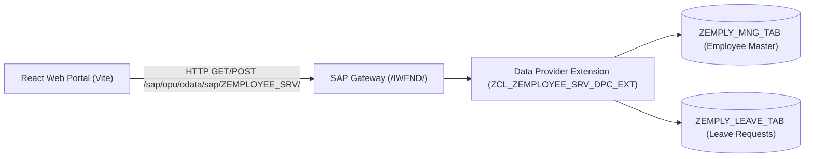

# 🛠️ SAP Gateway Service Builder (SEGW) — Step-by-Step Implementation

This guide provides the exact steps for freshers to build, register, and test the OData V2 service in classic SAP ABAP using SAP GUI.

---

## 📌 High-Level Architecture Overview

* **MPC (Model Provider Class):** Defines the metadata, entity types, properties, and entity sets.
* **DPC (Data Provider Class):** Handles the database fetching and business logic (CRUD-Q operations).
* **DPC_EXT (DPC Extension):** The subclass where developer ABAP code is written so future SEGW regenerations do not overwrite custom code!

---

## 🚀 Step 1: Create Project in Transaction `SEGW`

1. Open SAP GUI, run transaction **`SEGW`**.
2. Click **Create Project** icon (or `Ctrl + F1`):
   * **Project:** `ZEMPLOYEE_SRV`
   * **Description:** `Employee Workforce & Leave Management Gateway Service`
   * **Attributes:**
     * Project Type: `Standard (Service with SAP Annotations)`
     * Generation Strategy: `Standard`
   * **Package:** `$TMP` (Local Object) or your custom package (e.g., `ZDEV`).
3. Click **Continue** (Green Checkmark).

---

## 📦 Step 2: Define Entity Types & Entity Sets

### 2.1 Entity Type: `Employee`
1. Expand project ➔ Right-click **Data Model** ➔ **Create** ➔ **Entity Type**.
2. **Entity Type Name:** `Employee`
   * Check: **Create Related Entity Set**
   * **Entity Set Name:** `EmployeeSet`
3. Click **Continue**.
4. Double-click **Properties** folder under `Employee`:
   Add the following properties:

| Property Name | Key | Type | Length | Decimals | ABAP Field Name | Label |
| :--- | :---: | :--- | :---: | :---: | :--- | :--- |
| `Empid` | **X** | `Edm.String` | 10 | 0 | `EMPID` | Employee ID |
| `FirstName` | | `Edm.String` | 40 | 0 | `FIRST_NAME` | First Name |
| `LastName` | | `Edm.String` | 40 | 0 | `LAST_NAME` | Last Name |
| `Email` | | `Edm.String` | 100 | 0 | `EMAIL` | Email |
| `Department` | | `Edm.String` | 40 | 0 | `DEPARTMENT` | Department |
| `Designation` | | `Edm.String` | 50 | 0 | `DESIGNATION` | Designation |
| `Salary` | | `Edm.Decimal` | 15 | 2 | `SALARY` | Salary |
| `Currency` | | `Edm.String` | 5 | 0 | `CURRENCY` | Currency |
| `Status` | | `Edm.String` | 20 | 0 | `STATUS` | Status |
| `HireDate` | | `Edm.DateTime` | | | `HIRE_DATE` | Date of Joining |

---

### 2.2 Entity Type: `LeaveRequest`
1. Right-click **Data Model** ➔ **Create** ➔ **Entity Type**.
2. **Entity Type Name:** `LeaveRequest`
   * Check: **Create Related Entity Set**
   * **Entity Set Name:** `LeaveRequestSet`
3. Double-click **Properties** folder under `LeaveRequest`:
   Add the following properties:

| Property Name | Key | Type | Length | Decimals | ABAP Field Name | Label |
| :--- | :---: | :--- | :---: | :---: | :--- | :--- |
| `LeaveId` | **X** | `Edm.String` | 10 | 0 | `LEAVE_ID` | Leave ID |
| `Empid` | | `Edm.String` | 10 | 0 | `EMPID` | Employee ID |
| `LeaveType` | | `Edm.String` | 20 | 0 | `LEAVE_TYPE` | Leave Type |
| `StartDate` | | `Edm.DateTime` | | | `START_DATE` | Start Date |
| `EndDate` | | `Edm.DateTime` | | | `END_DATE` | End Date |
| `DaysCount` | | `Edm.Int32` | 10 | 0 | `DAYS_COUNT` | Days Count |
| `Reason` | | `Edm.String` | 255 | 0 | `REASON` | Reason |
| `Status` | | `Edm.String` | 20 | 0 | `STATUS` | Leave Status |
| `AppliedOn` | | `Edm.DateTime` | | | `APPLIED_ON` | Applied Date |

---

## 🔗 Step 3: Create Association (1 Employee ➔ N Leaves)

1. Right-click **Data Model** ➔ **Create** ➔ **Association**.
2. **Association Name:** `EmployeeToLeaves`
   * Principal Entity: `Employee` (Cardinality: `1`)
   * Dependent Entity: `LeaveRequest` (Cardinality: `0..n` or `*`)
   * Navigation Property for Principal: `LeaveRequests`
3. Click **Next** ➔ Set Referential Constraint:
   * Principal Key: `Empid` = Dependent Property: `Empid`
4. Click **Finish**.

---

## ⚡ Step 4: Define Function Imports (Custom Business Actions)

Function Imports allow calling custom actions like giving a raise or approving a leave:

1. Right-click **Data Model** ➔ **Create** ➔ **Function Import**.
2. **Function Import 1: `GiveRaise`**
   * Return Type: `Entity Type` ➔ `Employee`
   * HTTP Method: `POST`
   * Parameters:
     * `Empid` (`Edm.String`, Mandatory: `X`)
     * `PercentageRaise` (`Edm.Decimal`, Mandatory: `X`)
     * `Reason` (`Edm.String`, Mandatory: ` `)

3. **Function Import 2: `ApproveLeave`**
   * Return Type: `Entity Type` ➔ `LeaveRequest`
   * HTTP Method: `POST`
   * Parameters:
     * `LeaveId` (`Edm.String`, Mandatory: `X`)
     * `Empid` (`Edm.String`, Mandatory: `X`)

---

## ⚙️ Step 5: Generate Runtime Objects

1. Click the **Generate Runtime Objects** button on toolbar (the red-and-white striped beachball icon, or `Ctrl + F3`).
2. Accept the default class names:
   * Model Provider Class: `ZCL_ZEMPLOYEE_SRV_MPC`
   * Model Provider Extension: `ZCL_ZEMPLOYEE_SRV_MPC_EXT`
   * Data Provider Class: `ZCL_ZEMPLOYEE_SRV_DPC`
   * Data Provider Extension: `ZCL_ZEMPLOYEE_SRV_DPC_EXT`
3. Click **Save** ➔ Select `$TMP`.
4. Wait for the green success message: *"Runtime objects generated successfully"*.

---

## 💻 Step 6: Implement DPC_EXT Class (`SE24` or Eclipse)

1. In SEGW, expand **Runtime Artifacts** ➔ Right-click `ZCL_ZEMPLOYEE_SRV_DPC_EXT` ➔ **Workbench (SE24)**.
2. In Class Builder (`SE24`), switch to **Change Mode**.
3. Copy the implementation from:
   [`classic_abap/ZCL_ZEMPLOYEE_SRV_DPC_EXT.abap`](file:///d:/SAP%20Employee%20Management/classic_abap/ZCL_ZEMPLOYEE_SRV_DPC_EXT.abap)
4. Activate the class (**Ctrl + F3**).

---

## 🌐 Step 7: Register & Activate Service in `/IWFND/MAINT_SERVICE`

1. Open SAP GUI, run transaction **`/IWFND/MAINT_SERVICE`**.
2. Click **Add Service** button.
3. System Alias: Select `LOCAL` (or click F4 and choose your local backend alias).
4. Technical Service Name: `ZEMPLOYEE_SRV*` ➔ Press **Get Services**.
5. Select `ZEMPLOYEE_SRV` from table ➔ Click **Add Selected Services**.
6. Assign Package: `$TMP` ➔ Click **Continue**.
7. Message displayed: *"Service 'ZEMPLOYEE_SRV' was created and metadata was loaded successfully."*
8. Click Back (`F3`).

---

## 🧪 Step 8: Test in SAP Gateway Client (`/IWFND/GW_CLIENT`)

1. Find `ZEMPLOYEE_SRV` in `/IWFND/MAINT_SERVICE`.
2. Click **SAP Gateway Client** button in the bottom left (or run transaction `/IWFND/GW_CLIENT`).
3. Test URIs:
   * **Service Metadata:**
     `GET /sap/opu/odata/sap/ZEMPLOYEE_SRV/$metadata` ➔ Execute (HTTP 200 OK)
   * **Get All Employees (JSON):**
     `GET /sap/opu/odata/sap/ZEMPLOYEE_SRV/EmployeeSet?$format=json` ➔ Execute (Returns JSON list of employees)
   * **Get Single Employee with Leaves ($expand):**
     `GET /sap/opu/odata/sap/ZEMPLOYEE_SRV/EmployeeSet('100101')?$expand=LeaveRequests&$format=json`
   * **Fetch CSRF Token (for POST/PUT/DELETE):**
     Add Request Header: `X-CSRF-Token` = `Fetch`
     `GET /sap/opu/odata/sap/ZEMPLOYEE_SRV/` ➔ Check Response Header for returned `x-csrf-token`.
